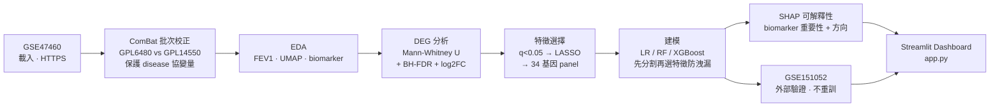
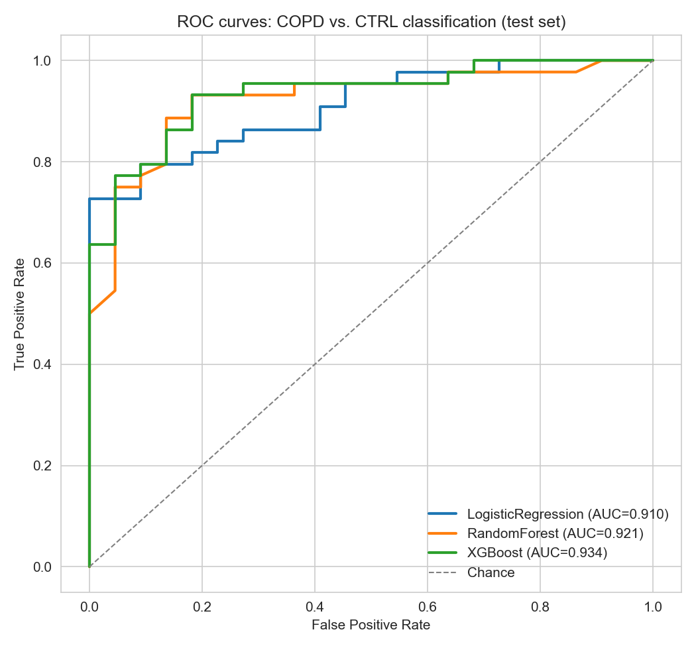
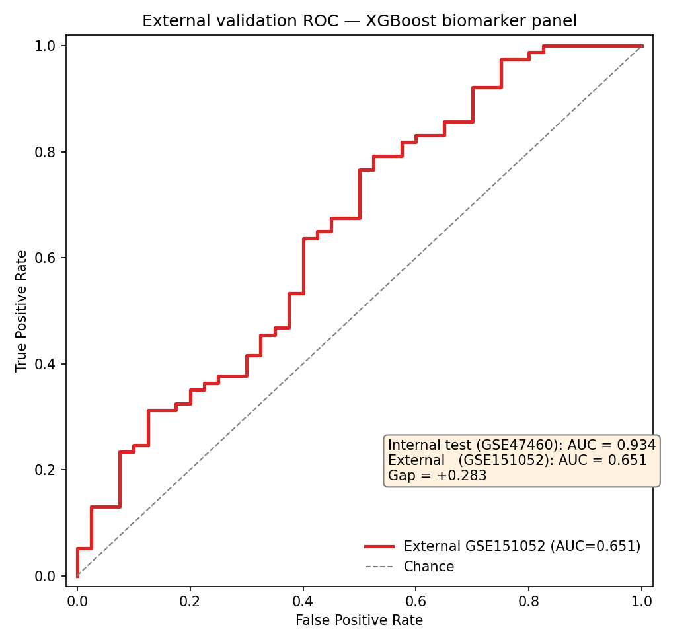
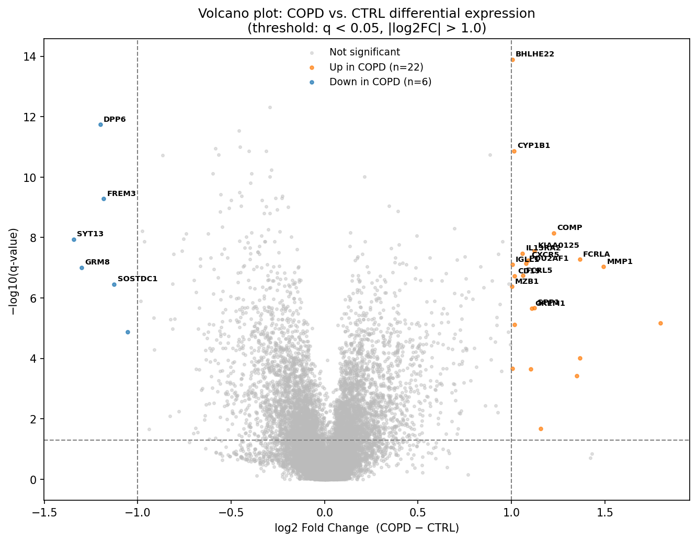
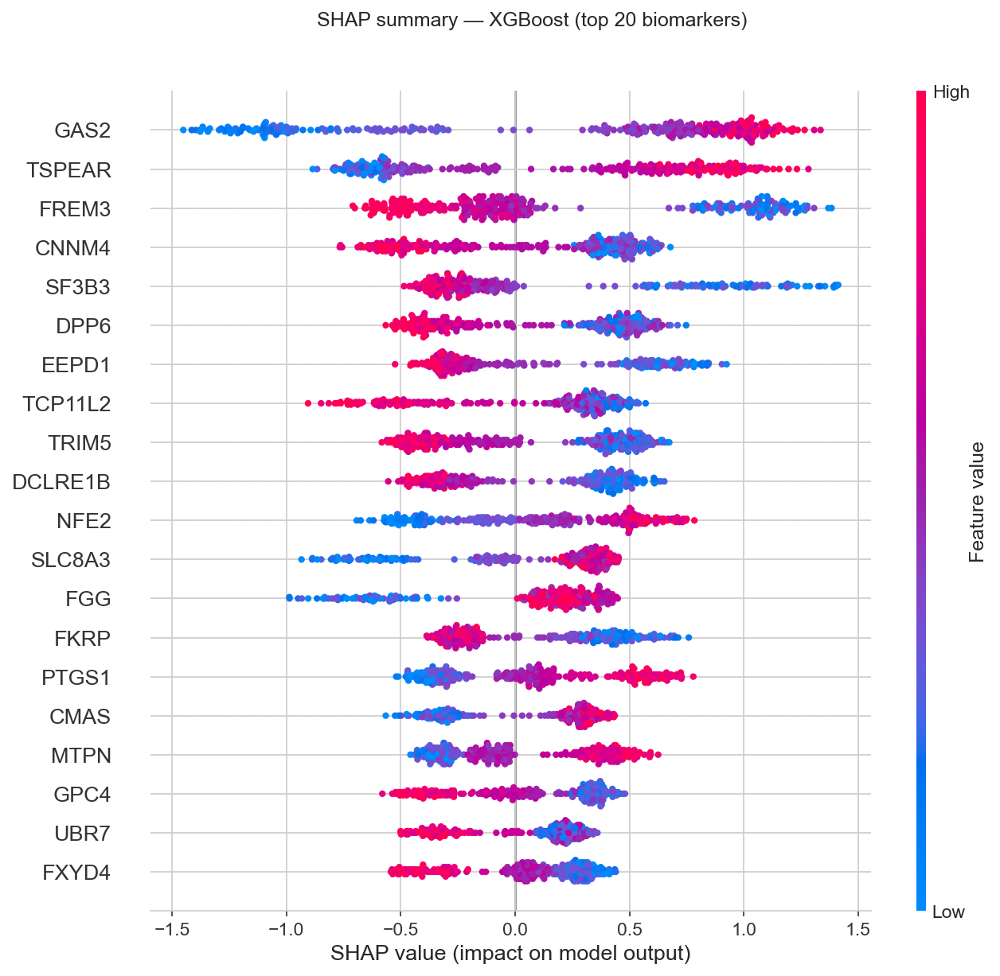

# COPD 肺部基因 AI 分析與 Biomarker 探索
### AI-Driven COPD Classification & Biomarker Discovery from Lung Gene Expression

> **一句話摘要**：從肺組織基因表現資料建立可解釋的 COPD 分類模型、篩選關鍵診斷 biomarker，並在獨立世代做外部驗證——模擬肺器官晶片的 AI 判讀核心。
>
> **TL;DR**: A reproducible, interpretable ML pipeline that classifies COPD vs. control from lung gene expression, surfaces diagnostic biomarkers (SHAP), and honestly validates on an independent cohort — mirroring the AI readout core of a lung organ-on-chip.

   

---

## 🫁 背景與應用情境　Background

久浪智醫的**肺器官晶片 (lung organ-on-chip)** 在體外重建肺部微環境，其價值鏈的關鍵一環是把晶片上的**分子/基因讀出 (molecular readout)** 轉譯成**疾病狀態的 AI 判讀**。本專案正是模擬這一段「**基因表現 → AI 判讀疾病 → 可解釋 biomarker**」的分析核心：

- **與產品直接相關**：器官晶片產生的高維分子數據，本質上與本專案處理的基因表現矩陣同類；能否從中穩健分類疾病、找出少數關鍵 biomarker，決定晶片作為診斷/藥物測試平台的價值。
- **可解釋性優先**：臨床/藥物情境不能只有黑箱預測。本專案以 **SHAP** 量化每個基因的貢獻，輸出可供生物學驗證的 biomarker panel。
- **泛化誠信**：晶片模型必須跨批次、跨平台可靠。本專案刻意做**外部驗證**並誠實揭露跨平台泛化落差，而非只報告單一資料集的理想數字。

---

## 📊 資料集　Datasets

| 用途 | GEO ID | 平台 | 樣本 | 說明 |
|------|--------|------|------|------|
| 訓練 / 探索 | **GSE47460** (LGRC) | Agilent GPL6480 + GPL14550 | **328**（COPD 220 / CTRL 108，已排除 ILD 254） | 15,180 共同基因（兩平台 collapse 成 gene symbol 取交集）|
| 外部驗證 | **GSE151052** | Affymetrix GPL17556 | **117**（COPD 77 / Control 40） | 跨平台，用 Entrez ID 匹配 biomarker panel |

**授權 License**：兩資料集皆為 NCBI GEO 公開資料，供學術研究自由使用。使用時請引用原始研究。原始表現資料與 SOFT 檔**未上傳版控**（見 `.gitignore`），執行腳本會自動從 GEO 以 HTTPS 下載。

---

## 🔬 方法流程　Pipeline



**方法學重點**：
- **批次校正**：兩 Agilent 平台以 ComBat 對齊，並保護 `disease_state` 協變量，避免洗掉疾病訊號（校正後 platform silhouette 0.062 → 0.000，disease 訊號完整保留）。
- **防資料洩漏**：先做 80/20 分層切分（`random_state=42`），LASSO 特徵選擇**只在訓練集**進行；模型持久化為 `train → save → serve`，外部驗證載入既有模型**不重新訓練**。
- **跨平台匹配**：訓練集（gene symbol）與外部集（Entrez ID）以 GSE47460 GPL 的 symbol↔Entrez 對照橋接，panel 33/34 命中。

---

## 🎯 關鍵結果　Key Results

### 三模型比較（內部測試集，n=66）

| 模型 | ROC-AUC | F1 | Precision | Recall | Accuracy |
|------|:-------:|:---:|:---------:|:------:|:--------:|
| Logistic Regression | 0.910 | 0.854 | 0.921 | 0.795 | 0.818 |
| Random Forest | 0.921 | 0.882 | 0.837 | 0.932 | 0.833 |
| **XGBoost（最佳）** | **0.934** | **0.909** | **0.909** | **0.909** | **0.879** |

### 外部驗證（GSE151052，獨立世代）

| 指標 | 內部測試 | 外部驗證 | 落差 |
|------|:-------:|:-------:|:----:|
| ROC-AUC | 0.934 | **0.651** | **+0.283** |
| F1 / Accuracy | 0.909 / 0.879 | 0.774 / 0.675 | — |

> **誠實揭露**：外部 AUC 0.651 明顯低於內部 0.934，主因為 **Agilent → Affymetrix 跨平台批次效應**。模型仍優於隨機（recall 0.844，少漏診 COPD），但這說明「單一世代高 AUC ≠ 可部署」。主動做外部驗證並揭露泛化落差，是本專案刻意展現的方法學嚴謹。

### 前 10 個 Biomarker（依 SHAP 重要性）

| 排名 | 基因 | 方向 | log2FC | SHAP 重要性 |
|:----:|------|------|:------:|:-----------:|
| 1 | **GAS2** | ↑ COPD | +0.70 | 0.852 |
| 2 | **TSPEAR** | ↑ COPD | +0.65 | 0.634 |
| 3 | **FREM3** | ↓ COPD | −1.18 | 0.485 |
| 4 | CNNM4 | ↓ COPD | −0.29 | 0.415 |
| 5 | SF3B3 | ↓ COPD | −0.16 | 0.413 |
| 6 | DPP6 | ↓ COPD | −1.20 | 0.405 |
| 7 | EEPD1 | ↓ COPD | −0.29 | 0.394 |
| 8 | TCP11L2 | ↓ COPD | −0.39 | 0.384 |
| 9 | TRIM5 | ↓ COPD | −0.16 | 0.382 |
| 10 | DCLRE1B | ↓ COPD | −0.31 | 0.369 |

DEG 分析共找出 **28 個顯著差異表現基因**（q<0.05 且 |log2FC|>1）；免疫/B 細胞群（CXCR5、FCRLA、MZB1…）與 MMP1 上調，符合 COPD 淋巴濾泡浸潤與 ECM 破壞的病理。

<p align="center">
  
  
</p>
<p align="center">
  
  
</p>

---

## 🖥️ 互動 Dashboard　Interactive Demo

```bash
streamlit run app.py
```

四頁式 Streamlit：**① 專案總覽 · ② EDA 探索 · ③ 模型結果 · ④ 病人預測 Demo**。頁面四可拖動 5 個關鍵基因的滑桿，**即時**顯示 XGBoost 的 COPD 預測機率與對應 GOLD 分期範圍（示意）。

---

## 📁 資料夾結構　Structure

```
COPD-biomarker-analysis/
├── app.py                        # Streamlit 4-page dashboard
├── src/
│   ├── 01_data_loading.py        # 載入 GSE47460 + ComBat 批次校正
│   ├── 02_eda.py                 # 5 張 EDA 圖
│   ├── 03_deg_analysis.py        # DEG (Mann-Whitney + BH-FDR) + volcano/heatmap
│   ├── 04_modeling.py            # LASSO → LR/RF/XGBoost + SHAP + 存出模型
│   └── 05_external_validation.py # GSE151052 外部驗證（不重訓）
├── figures/                      # 產出圖表（版控）
├── results/                      # DEG 表、biomarker panel、模型比較、外部驗證（版控）
├── data/                         # 原始資料（.gitignore，執行時自動下載）
├── models/                       # 訓練好的模型 bundle（.gitignore）
├── requirements.txt
└── README.md
```

---

## ⚙️ 安裝與執行　Setup & Run

建議使用 **Python 3.13**（於 Anaconda 測試）。

```bash
# 1) 安裝依賴
pip install -r requirements-dev.txt   # 完整 pipeline 依賴
# （只想跑 Dashboard 的話：pip install -r requirements.txt）

# 2) 依序執行 pipeline（腳本會自動從 GEO 下載資料）
python src/01_data_loading.py        # 載入 + 批次校正
python src/02_eda.py                 # EDA 圖
python src/03_deg_analysis.py        # 差異表現分析
python src/04_modeling.py            # 特徵選擇 + 建模 + SHAP（產生模型 bundle）
python src/05_external_validation.py # 外部驗證

# 3) 啟動互動 Dashboard
streamlit run app.py
```

---

## 🚀 未來延伸方向　Future Work

1. **縮小跨平台泛化落差**：導入跨世代正規化（ComBat / quantile）或 **rank-based 平台穩健特徵**，並改用 nested CV（每折內重算 DEG）以完全消除特徵選擇洩漏。
2. **多世代訓練與域適應**：合併更多 GEO COPD 世代（跨平台）共同訓練，或採 domain adaptation，提升模型在未見平台上的可部署性。
3. **從二元分類走向嚴重度與即時整合**：加入 **GOLD 分期的序數回歸**（結合 FEV1），並將模型串接器官晶片的即時感測讀出，逼近久浪智醫「晶片 → 分子讀出 → AI 判讀」的端到端情境。

---

*Author: Landy Huang（黃昱霖）· 資料來源：NCBI GEO（GSE47460, GSE151052）· 本專案為求職用個人研究專案。*
